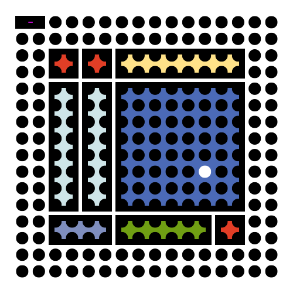

# modulo
A Toolkit for Tinkering with Digital Musical Instruments. 

## About 
Think of it as a "Lego" set for your musical ideas. Each module is designed with simplicity and versatility in mind, where core functionalities and patching are housed within a compact and user-friendly interface. You can mix, match, customize, and extend your own musical tools in a modular and multichannel workflow. Happy patching!

## Modules

- [input](https://github.com/francesco-di-maggio/modulo/tree/main/patchers/input) modules can be used to generate, display and map input data, such as pads, dials, sliders, and computer keyboard input.

- [route](https://github.com/francesco-di-maggio/modulo/tree/main/patchers/route) modules can be used to interface with external devices, including Max internal routing, MIDI, OSC, and Euroracks. 

- [transform](https://github.com/francesco-di-maggio/modulo/tree/main/patchers/transform) modules can be used to process and extract meaningful information from incoming signals, through different algorithms such as filtering, averaging and smoothing.

- [utility](https://github.com/francesco-di-maggio/modulo/tree/main/patchers/utility) modules can be used to handle auxiliary functions, such as mixing, visualising and recording input data.

## Architecture

### Modularisation of Max objects

Each module is a wrapper around a specific Max object (e.g. mo.snapshot > snapshot), where core control parameters are displayed at the top level in the main GUI . This allow the user to flexibly interchange modules for creating different digital musical instruments on the fly. 

### List & Multichannel

Modules can stream either control signals (numeric data) or audio signals. The latter can be distinguished in their name by the appended ```/~``` (tilde) symbol. Each module accepts either a list of data (control signals), or multichannel audio signals (```mc.```). As each device permits a different set of input channels, each module is designed to automatically adapt to the number of input channels. Please note that Max’s DSP engine has to be refreshed (turned off and on) to update the number of channels.

### Abstractions & Bpatchers

Users can combine two different methods of patching:

1. *Abstractions* (with objects exposed): Each module is instantiated in the main patcher window as an abstraction, where the main parameters can be modified using the appropriate message (e.g. ```mute 1```).

”) *Abstractions (with objects exposed)*

2. *Bpatchers* (with GUI exposed): Each module is instantiated as bpatchers, which exposes parameters in a graphical user interface.

”) *Bpatchers (with GUI exposed)*

### Preset

Each parameter in a module GUI is “bound" to a <pattr> object, using a consistent namespace  in the GUI, abstraction and help files. This means that the <preset> object can be used in conjunction with <pattrstorage> (see help file) to save and recall a snapshot of all parameters in a patcher window.

## Installation

Search for ```modulo``` in the Max Package Manager or find it under the Featured Package section. 

If you have [Git](http://git-scm.com/) or [GitHub Desktop](https://desktop.github.com/) installed, you can clone this repo via Terminal using the following commands:

	cd ~/Documents/Max\ 8/Packages
	git clone https://github.com/francesco-di-maggio/modulo

If not, you can download the latest release [here](https://github.com/francesco-di-maggio/modulo). After decompressing the zip archive, place the resulting folder in the Max search path, preferably in:

* `~/Documents/Max\ 8/Packages`

## Get Started

Open the Overview Patch (modulo-main/extras/modulo.maxpat).

## Links

[Discord](https://discord.com/invite/5tTx4hX9up) - Join the Discord discourse to keep up on future updates/news as well as make suggestions, share ideas and musical examples.

[YouTube](https://www.youtube.com/playlist?list=PL0HEDTmJk6S35kALgX0dJLxeMekfEu2rF) - Join the YouTube channel to discover how to get started with ```modulo```.

